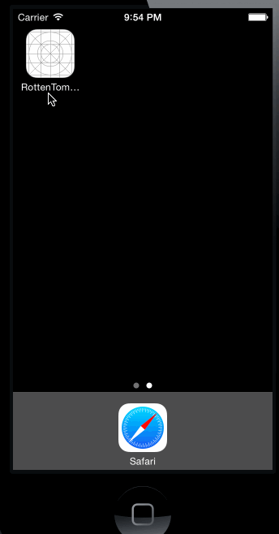

RottenTomatoes Demo
=============

This is an iOS demo application for displaying the latest box office movies and top DVD rentals using the RottenTomatoes API.

Time spent: 5 hours spent in total

Completed user stories:

* User can view a list of movies from Rotten Tomatoes.  Poster images must be loading asynchronously.
* User can view movie details by tapping on a cell
* User sees loading state while waiting for movies API.
* User sees error message when there's a networking error.
* User can pull to refresh the movie list.

Optional:

* Tab bar to switch between Box office and top DVD rentals.

